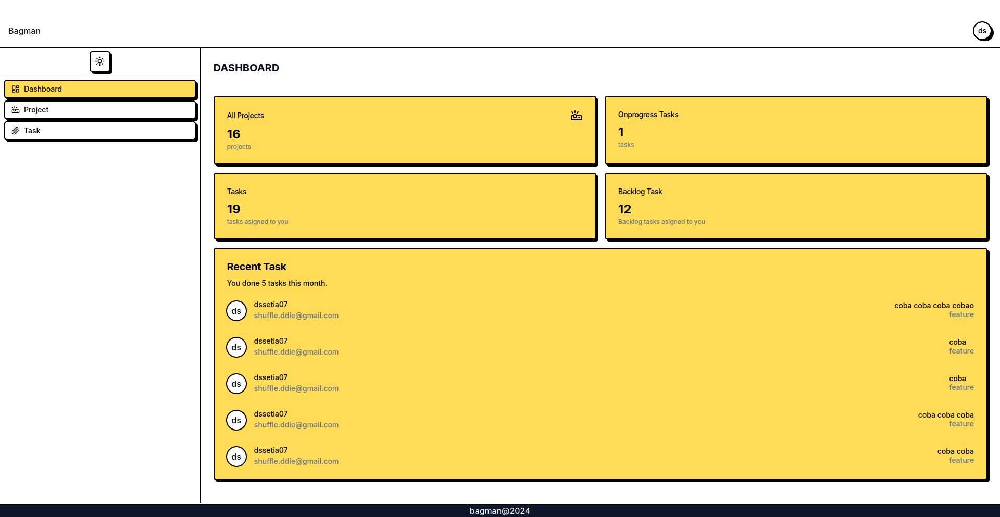
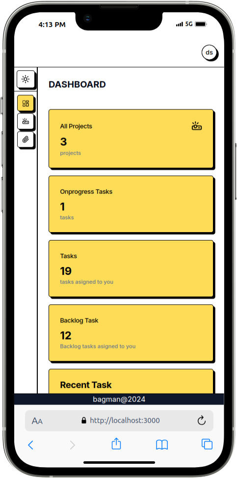
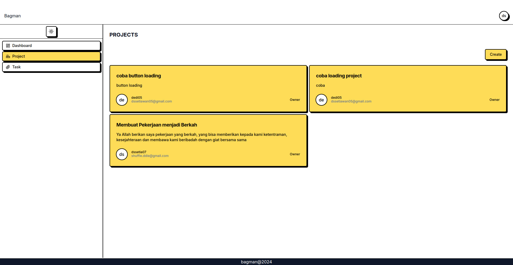
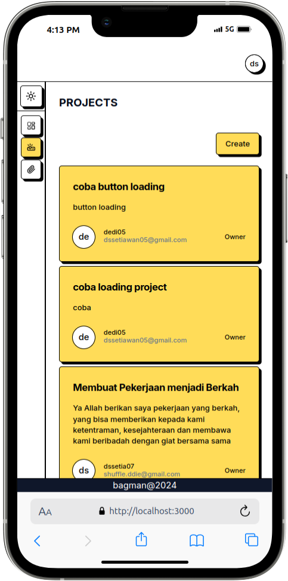
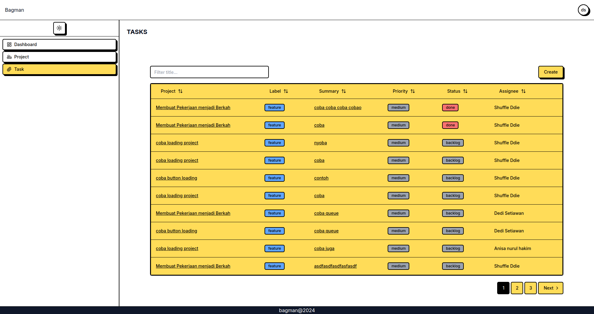

# Bagman

**Bagman** is a simple, intuitive task management tool designed to help teams collaborate more efficiently and track their work progress. i hope **Bagman** can help you to stay on track.

## Table of Content

1. [Feature](#features)
2. [Installation](#installation)
3. [Usage](#usage)
4. [Configuration](#configuration)
5. [Contribution](#contribution)
6. [License](#license)
7. [Contact](#contact)

---
## Features
- **Task management:** Easily create, assign, and track tasks within a project.
- **Project management:** Easily create and track project.
- **Real-time notifications:** Receive updates on task assignments, and comments in real time.
- **Verification email** verification active email.
- **User authentication:** Secure login with JWT-based authentication and cookies http only.
- **Simple, intuitive interface:** A dashboard that helps users quickly navigate through tasks and projects.

---
## Installation
### Prerequisites
- **Node.js** version 14.x or higher
- **PostgreSQL** version 16.x or higher
- **firebase** for push notification

### Steps to Install

1. Clone the repository:
```bash
   git clone https://github.com/setiawanDedi05/bagman.git
```
2. Navigate to the project directory:
```bash
    cd bagman
```
3. install dependencies:
- frontend:
```bash
    cd frontend/ && npm install
```
- backend:

```bash
    cd backend/ && npm install
```
4. set up environtment variables:
- frontend:
    - create .env file in the root frontend folder with the following:
```bash
NEXT_PUBLIC_API_URL=your-url-backend
NEXT_PUBLIC_FIREBASE_API_KEY=your-firebase-api-key
NEXT_PUBLIC_FIREBASE_AUTH_DOMAIN=your-firebase-auth-domain
NEXT_PUBLIC_FIREBASE_PROJECT_ID=your-firebase-project-id
NEXT_PUBLIC_FIREBASE_STORAGE_BUCKET=your-firebase-storage-bucket
NEXT_PUBLIC_FIREBASE_MESSAGING_SENDER_ID=your-firebase-messaging-sender-id
NEXT_PUBLIC_FIREBASE_APP_ID=your-firebase-app-id
NEXT_PUBLIC_VAPID_KEY=your-vapid-key
NEXT_PUBLIC_MEASUREMENT_ID=your-measurement-id  
```
- backend:
    - create .env file in the root backend folder with the following:
```bash
PORT=3001
DB_HOST=localhost
DB_PORT=5432
DB_USERNAME=your-psql-localhost
DB_PASSWORD=your-psql-password
DB_NAME=your-db-name
JWT_SECRET=your-secret-key
NODE_ENV=development
EMAIL_HOST=smtp.gmail.com
EMAIL_PORT=587
EMAIL_USER=your-email-use-to-send-email
EMAIL_PASSWORD=secret-password-is-not-your-email-password
FRONTEND_URL=url-frontend
FIREBASE_PROJECT_ID=your-firebase-project-id
FIREBASE_PRIVATE_KEY==your-firebase-private-key
FIREBASE_CLIENT_EMAIL=your-firebase-email

```
5. start the development server
- frontend :
```bash
    cd frontend/ && npm run dev
```
- backend :
```bash
    cd backend/ && npm run start:dev
```

6. open your browser and goto http://localhost:3000

---
## Usage

if the installation have you follow, you can directly register and verify your email, and than you can login. and i'm confident the app is easier to use.

---
## License

his project is licensed under the MIT License. See the [LICENSE](https://opensource.org/licenses/MIT) file for details.

---
## Contact
For questions, feedback, or support, feel free to contact us:

Email: dssetiawan05@gmail.com

Linkedin: https://www.linkedin.com/in/dedi-setiawan-05/

---
# Example Screenshoot
## Here's an example of the app:













